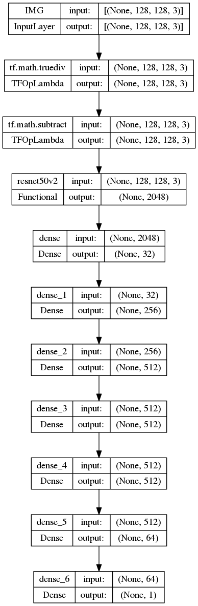
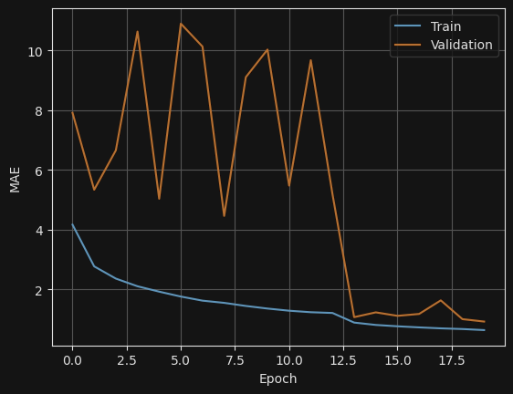

# 계란 보관 일 수 데이터

## 환경 준비 및 실행

### 제공된 컨테이너 없이 로컬 환경에서 실행하기

#### 1. `Anaconda` 설치하기

```shell
$ wget https://repo.anaconda.com/archive/Anaconda3-2022.10-Linux-x86_64.sh
```

#### 2. `Anaconda`를 사용한 가상환경 생성
본 repository에 있는 environment.yaml은 학습에 필요한 python package 정보들을 포함하고있습니다.
아래의 명령어를 사용하여, 자신의 로컬 환경에서 모델을 본 모델을 학습/추론 할 수 있는 환경을 구축할 수 있습니다.

```shell
conda env create --file environment.yaml
```

### 제공된 컨테이너 환경에서 실행하기

#### 1. 컨테이너 이미지 설치하기
```shell
$ docker import kkokkobot-freshness-gpu.tar - kkokkobot/freshness:devel-gpu
```

#### 2. 컨테이너 이미지 실행하기
```shell
docker run -it --gpus="device=0" -v [datapth]:/kkokkobot/data kkokkobot/freshness:devel-gpu /bin/bash
```


## 모델

본 레포지토리에서는 데이터 셋 사용 예시로써, ResNet-50을 backbone으로 한 single value regression 모델을 제공합니다.
이를 위해 제공되는 모델은 두 종류입니다. `Full`의 경우 image와 세척 여부를 모두 입력으로 받는 모델이며, `ImageOnly`의 경우 단일 계란 이미지만을 입력으로 받습니다.
모델 선택은 학습 혹은 추론 수행 시 `--model` 를 통해 인자를 전달할 수 있습니다.



다음은 학습 결과 예시를 보여줍니다.



## 실행

```shell
usage: main.py [-h] [--train] [--csv-path CSV_PATH] [--data-path DATA_PATH] [--seed SEED] [--model MODEL] [--epochs EPOCHS] [--batch-size BATCH_SIZE]
               [--save-model SAVE_MODEL] [--gpus GPUS [GPUS ...]]

KKoKKo-BOT FRESHNESS dataset handling model

optional arguments:
  -h, --help            show this help message and exit
  --train               If you want to train the model, please pass True to train argument if you want to do an inference only, please pass False to train
                        argument
  --csv-path CSV_PATH
  --data-path DATA_PATH
  --seed SEED
  --model MODEL         The user can choose between "Full" and "ImageOnly"
  --epochs EPOCHS
  --batch-size BATCH_SIZE
  --save-model SAVE_MODEL
  --gpus GPUS [GPUS ...]
```

#### 1. 컨테이너 안에서 모델 학습하기 
```shell
/kkokkobot$ python main.py --train --save-model ./freshness_model_img_wash_best.hdf5 --data ./data --gpus "/gpu:0"
```
본 컨테이너는 multi-GPU 학습도 지원합니다. multi-GPU 사용을 위해서는 --gpus 의 인자로 여러개의 gpu 정보를 넘겨주세요.
```shell
/kkokkobot$ python main.py --train --save-model ./freshness_model_img_wash_best.hdf5 --data ./data --gpus "/gpu:0" "/gpu:1"
```

#### 2. 컨테이너 안에서 모델 학습 후 추론하기
```shell
/kkokkobot$ python main.py --save-model ./freshness_model_img_wash_best.hdf5 --data ./data
```
