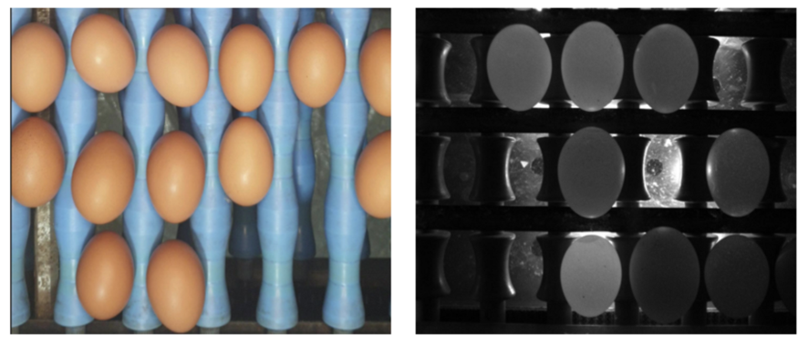
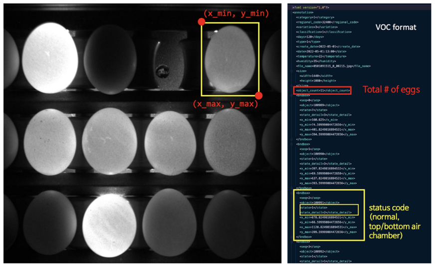

# 계란 데이터 구축 사업 데이터 활용 AI 모델 Repository

본 레포지토리는 NIA의 인공지능 데이터 셋 구축 사업의 일환으로 진행된 계란 데이터 구축 사업에서 수행된 결과물인 데이터 셋의 활용 예시 모델을 제공합니다.
구축된 데이터는 세 종류로, `Detection`, `Classification`, `Regression` 용 데이터셋입니다.
`Detection` 데이터와 `Classification` 데이터는 각각 `MONO` 이미지와 `COLOR` 이미지를 가지고 있습니다.
`Classification` 데이터는 `Detection`데이터셋으로부터 구성된 데이터로 동일한 원천 데이터에 대해 입.출력은 다른 포맷을 가집니다.
`Classification` 데이터는 본 과제 수행 목표 외의 추가 활용을 위하여 제공되는 데이터 셋으로, `Deteciton`데이터로부터 단일 계란 이미지를 crop한 형태입니다.

- `Detection` 폴더는 계란 상태 자동 탐지 데이터 셋을 학습 & 추론하는 코드를 포함합니다.
우리는 Faster R-CNN 모드와 DETR 모델의 학습 & 추론 코드를 제공합니다.

- `Classification` 폴더는 입력되는 하나의 계란 이미지로부터 상태를 분류하는 분류기 모델의 학습 및 추론 코드를 포함하고있습니다.
우리는 전형적인 CNN 모델인 ResNet, ResNext, Xception 네트워크와 Transformer 모델인  ViT, SwinTransformer의 학습 및 추론 코드를 제공합니다.

- `Prediction` 폴더는 입력되는 하나이 계란 이미지로부터 상온에 보관된 일 수를 예측하는 회귀 모델의 학습 및 추론 코드를 포함하고있습니다.
우리는 ResNet 모델과 FC Layer를 사용한 모델을 제공하고있습니다.


## 계란 상태 자동 탐지 데이터 셋

계란 상태 탐지 데이터는 투광 이미지 (MONO)와 카메라 이미지 (COLOR)로 구성됩니다. 각 이미지는 1080 x 1440의 해상도를 가지며 하나의 이미지 내에 1개 이상의 계란을 포함되며 한 장의 영상에 대한 라벨은 영상의 중앙을 기점으로 최대 3 x 4 (12개) 계란에 대한 객체 바운딩 박스와 각 계란의 상태 코드로 구성됩니다.




**그림 1**. 계란 상태 자동 탐지 데이터 이미지 (좌) 카메라 이미지 (우) 투광 이미지.




**그림 2**. 계란 상태 자동 탐지 데이터 셋 입력, 라벨 구조 예시.

계란 상태 자동 탐지 데이터의 라벨은 객체 탐지 데이터에서 많이 사용되는 VOC의 변형된 형식을 따릅니다. 
XML 형태로 라벨이 생성되며 입력 이미지 내에 존재하는 객체의 수, 그리고 각 객체 별 정보를 포함하고있습니다. 
객체 별 정보에는 상태 코드 (state)와 세부 상태 코드 (state_detail) 그리고 X, Y 좌표로 표기되는 바운딩 박스 정보로 이루어집니다. 
바운딩 박스 정보는 X_MIN, X_MAX, Y_MIN, Y_MAX로 주어지며 이는 (X_MIN, Y_MIN)을 좌 상단으로하여 (X_MAX, Y_MAX)를 우 하단으로하는 상자를 의미합니다.

```xml
<?xml version="1.0"?>
<annotation>
 <category>1</category>
 <regional_code>32400</regional_code>
 <varieties>3</varieties>
 <classification>1</classification>
 <days>120</days>
 <type>1</type>
 <create_date>2022-05-01</create_date>
 <date>2022-05-01:13:00</date>
 <temperature>22</temperature>
 <humidity>35</humidity>
 <file_name>0501091314_0_00062.jpg</file_name>
 <size>
   <width>1440</width>
   <height>1080</height>
 </size>
 <object_count>4</object_count>
 <bndbox>
   <seq>0</seq>
   <object>2797</object>
   <state>1</state>
   <state_detail>2</state_detail>
   <x_min>168.50000000000006</x_min>
   <y_min>397.9722235616849</y_min>
   <x_max>384.5208323287364</x_max>
   <y_max>686</y_max>
 </bndbox>
 <bndbox>
   <seq>1</seq>
   <object>2798</object>
   <state>7</state>
   <state_detail>4</state_detail>
   <x_min>411.4999999999998</x_min>
   <y_min>418.2398208287235</y_min>
   <x_max>625.8201343784569</x_max>
   <y_max>688.9999999999995</y_max>
 </bndbox>
```

## 계란 보관 일 수 예측 데이터 셋

제공되는 계란 보관일 수 예측 데이터 셋은 다음과 같은 구조를 갖습니다.
폴더는 계란의 세척 여부, 그리고 부가정보로서 제공되는 계란상태 코드를 포함하고있으며, 더 자세한 라벨 정보는 각 이미지 이름에 해당하는 xml 파일에 추가로 기재되어있습니다.

```
/data
|_1일/
|   |_세척/
|   |   |_ 기형/
|   |   |   |_1234.jpg
|   |   |   |_1234.xml
|   |   |- 크랙/
|   |   |- 혈반/
|   |   |- 정상/
|   |   |- 이물질/
|   |   |- 잠재크랙/
|   |_비세척/
|        |_ ...
|_2일/
...
```